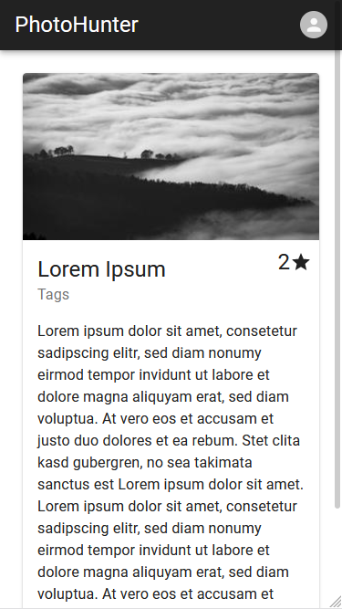

# Photohunter

 

## About

PhotoHunter is a Photography Location Scout Platform. Find, Share and rate the most beautiful photography locations in the world.

https://photohunter.herokuapp.com/

## Impressions

## Instructions

- clone
- run springserver-application
- cd frontend
- npm install
- npm start

